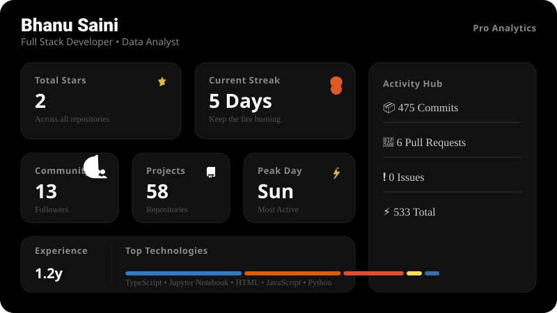
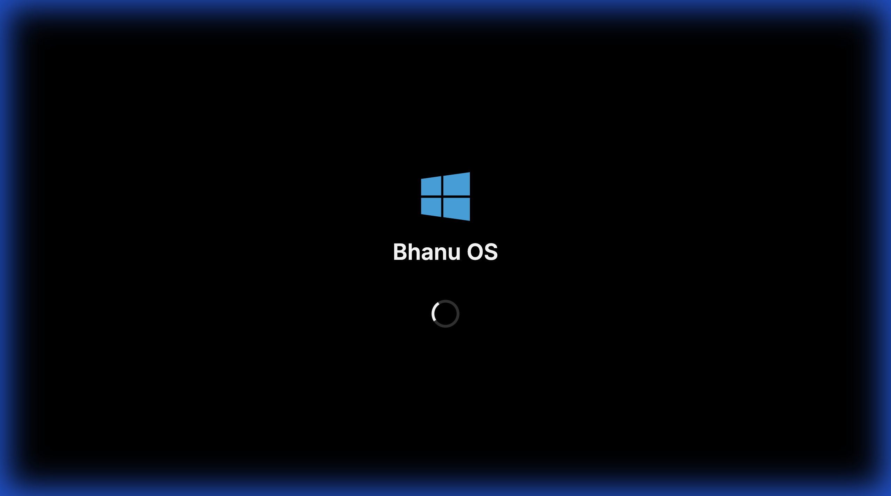
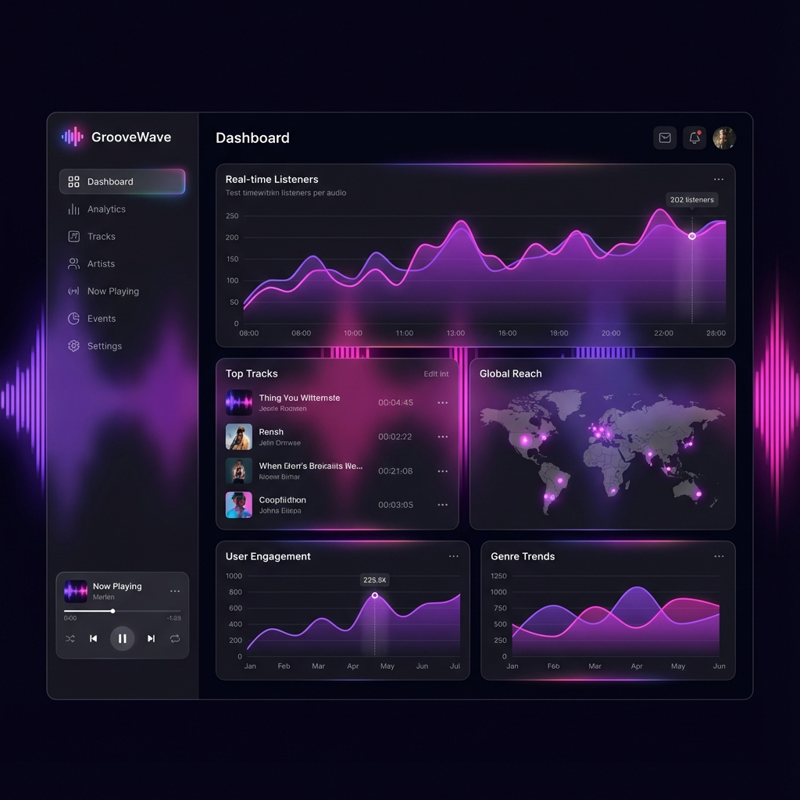
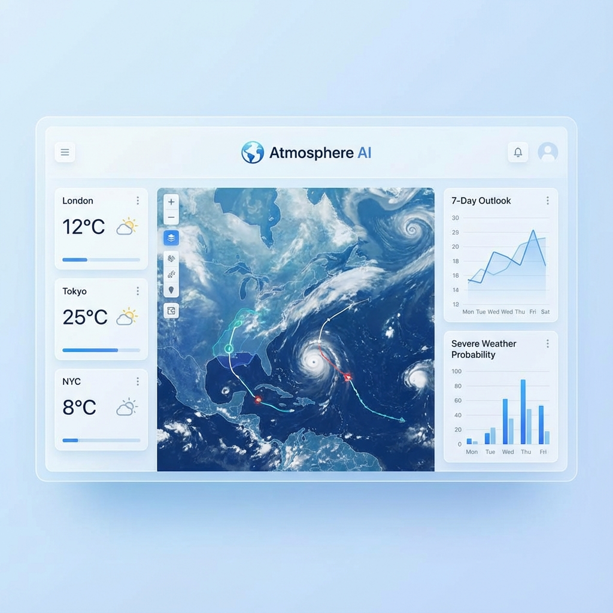
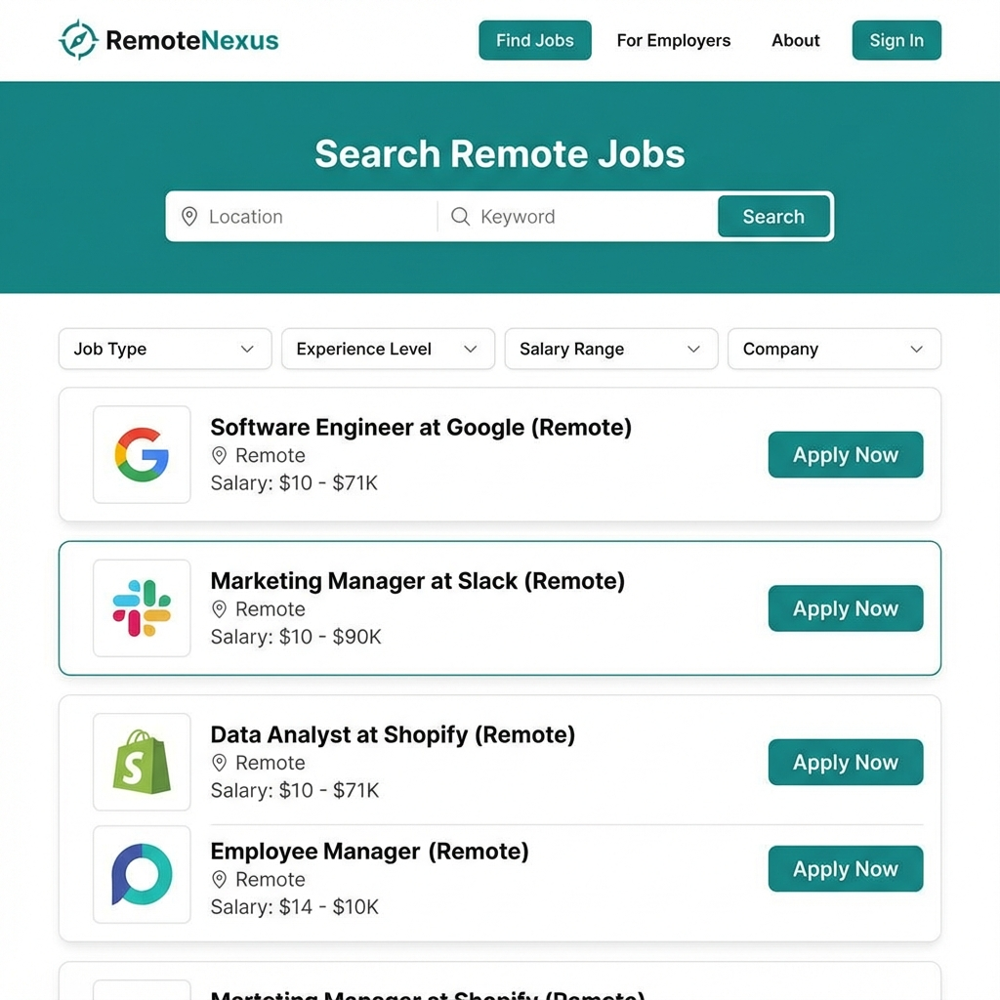
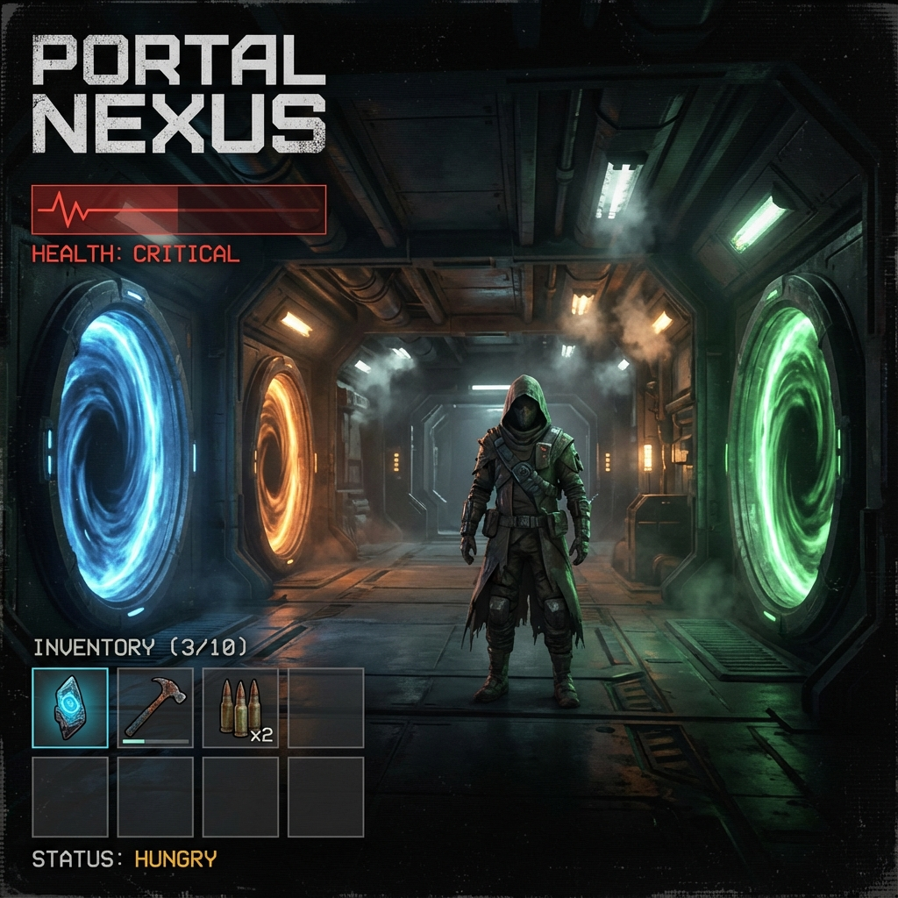
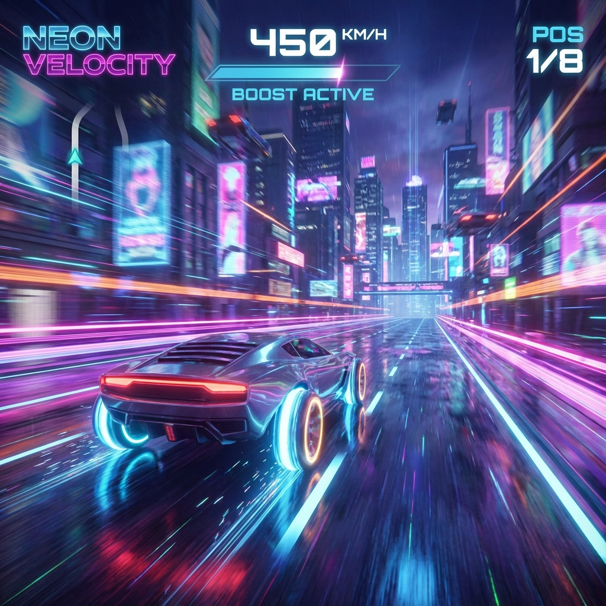
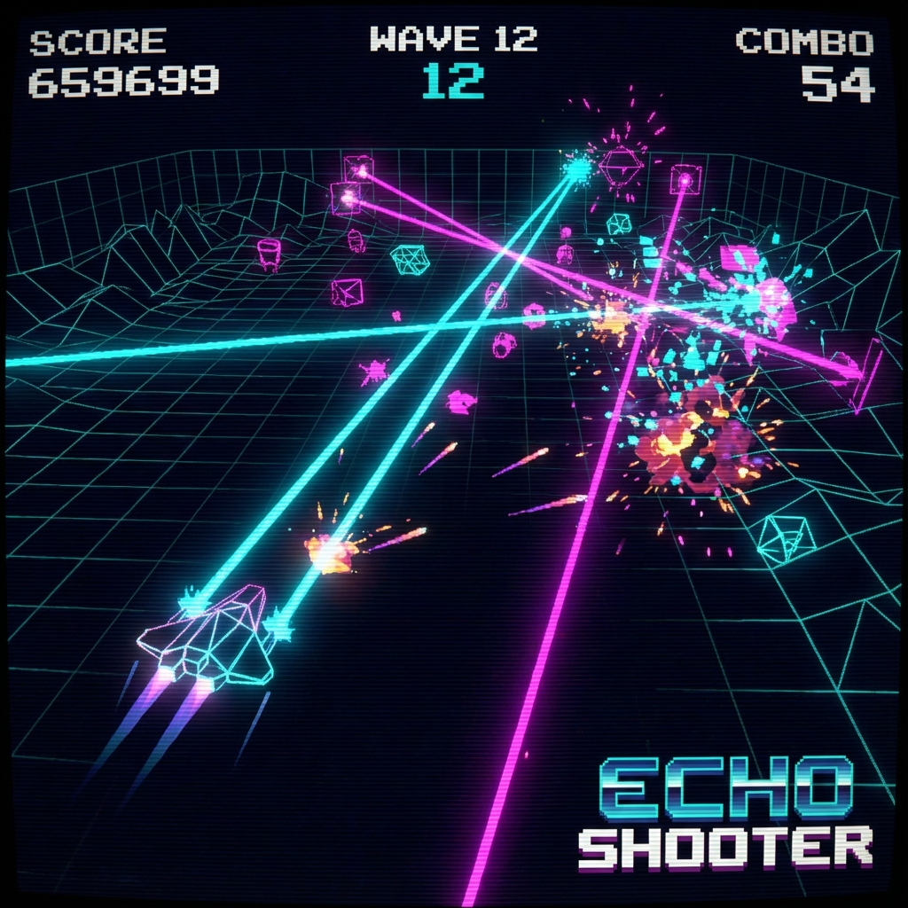
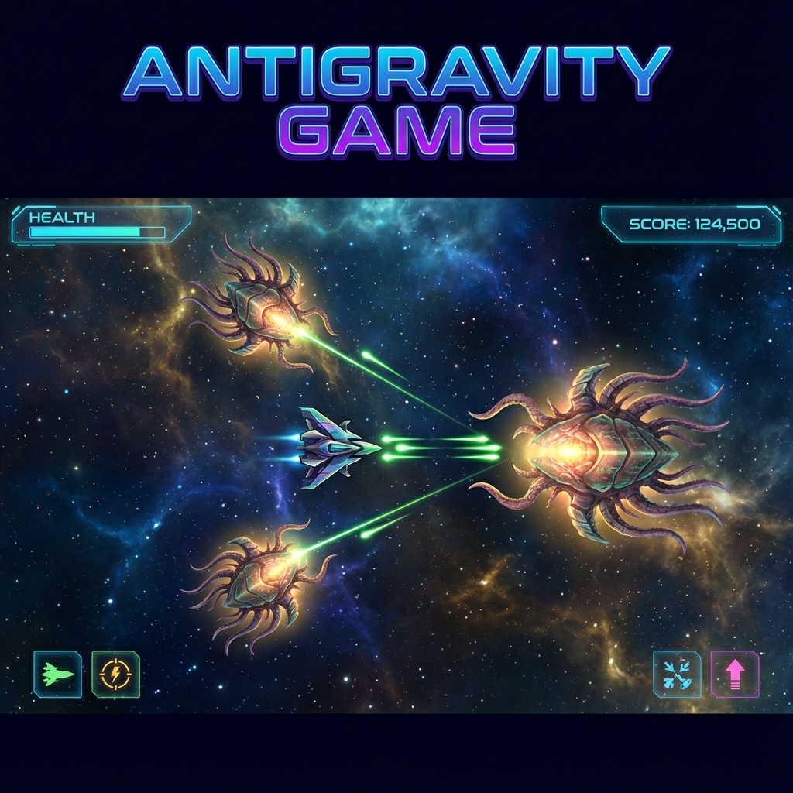
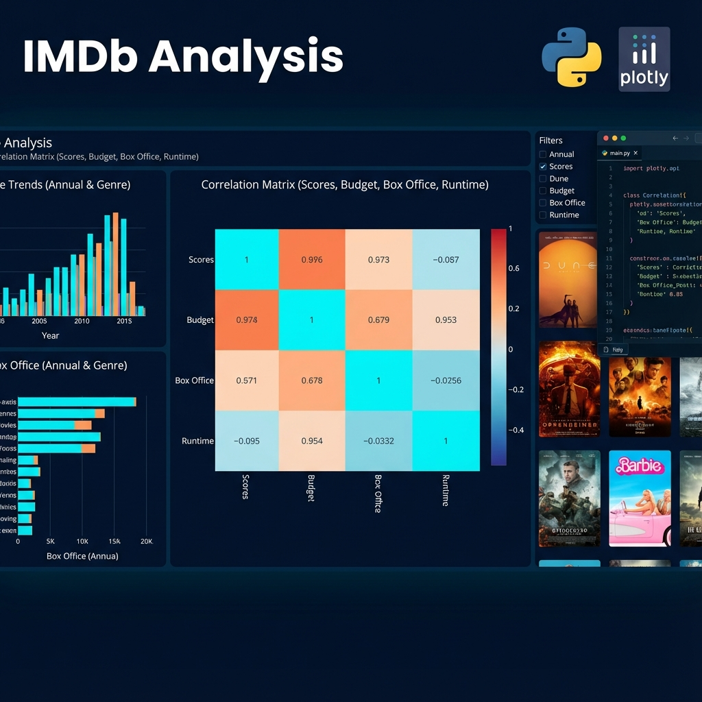

# Hi there, I'm Bhanu Saini! 👋

### 🚀 **Full Stack Developer** | 🤖 **Gen AI Enthusiast** | 🎮 **Game Creator** | 📊 **Data Analyst**

  

 

## 📈 **GitHub Stats**

  

I am a **Data Science** student at **IIT Madras** with a passion for building software that feels _alive_. From complex SaaS platforms to immersive 3D games, I bridge the gap between heavy backend logic and stunning, interactive frontends.

---

## 🖥️ **The Portfolio OS**

Experience my work in a fully functional **Windows-style Operating System** running in your browser.
**[� Launch Bhanu OS](https://bhanu2006-24.github.io/bhanu2006-24/)**

  

 

---

## 💎 **Featured Web Applications**

| Project                                                                                                                                                                                                                                                                                                          | Preview                                                                                              |
| :--------------------------------------------------------------------------------------------------------------------------------------------------------------------------------------------------------------------------------------------------------------------------------------------------------------- | :--------------------------------------------------------------------------------------------------- |
| **GrooveWave** _Next-Gen Music Analytics SaaS_  • **Tech**: React, TypeScript, Cloudflare • **Features**: Real-time streaming analytics, glassmorphism UI, artist dashboards.  🚀 **[Live Demo](https://groovewave.pages.dev/)** • 💻 **[GitHub](https://github.com/bhanu2006-24/groovewave)** |        |
| **NovaNews** _Intelligent News Aggregator_  • **Tech**: React 19, Vite, AI Integration • **Features**: Smart categorization, clean reading mode, real-time global updates.  🚀 **[Live Demo](https://novanews.pages.dev/)** • 💻 **[GitHub](https://github.com/bhanu2006-24/novanews)**        |            |
| **Atmosphere AI** _Advanced Weather Intelligence_  • **Tech**: React, AI Modeling, Data Viz • **Features**: Predictive climate modeling, interactive weather maps, dark mode.  💻 **[GitHub](https://github.com/bhanu2006-24/atmosphere-ai)**                                                  |  |
| **RemoteNexus** _Premium Job Portal_  • **Tech**: React, Node.js, Tailwind • **Features**: Advanced filtering, company profiles, seamless application flow.  🚀 **[Live Demo](https://remotenexus.pages.dev/)** • 💻 **[GitHub](https://github.com/bhanu2006-24/remotenexus)**                 |      |

---

## � **Immersive Game Development**

| Project                                                                                                                                                                                                                                                  | Preview                                                                                               |
| :------------------------------------------------------------------------------------------------------------------------------------------------------------------------------------------------------------------------------------------------------- | :---------------------------------------------------------------------------------------------------- |
| **Portal Nexus** _Sci-Fi Survival RPG_  • **Tech**: TypeScript, Procedural Gen • **Gameplay**: Explore 100+ interconnected rooms, manage resources, survive anomalies.  💻 **[GitHub](https://github.com/bhanu2006-24/portal-nexus)**  |     |
| **Neon Velocity** _Cyberpunk 3D Racer_  • **Tech**: Three.js, WebGL • **Gameplay**: High-speed arcade racing in a procedurally generated neon city.  💻 **[GitHub](https://github.com/bhanu2006-24/neon-velocity)**                    |   |
| **Echo Shooter** _Neon Arena Shooter_  • **Tech**: HTML5 Canvas, Physics Engine • **Gameplay**: Survive waves of enemies with overdrive abilities and particle effects.  💻 **[GitHub](https://github.com/bhanu2006-24/Echo-shooter)** |     |
| **Antigravity** _Space Bullet Hell_  • **Tech**: JavaScript, Game Logic • **Gameplay**: Top-down shooter with unique boss mechanics and power-ups.  💻 **[GitHub](https://github.com/bhanu2006-24/antigravity-game)**                  |  |

---

## 📊 **Data Science & Intelligence**

| Project                                                                                                                                                                                                                                             | Preview                                                                                              |
| :-------------------------------------------------------------------------------------------------------------------------------------------------------------------------------------------------------------------------------------------------- | :--------------------------------------------------------------------------------------------------- |
| **IMDb Analytics** _Cinema Data Dashboard_  • **Tech**: Python, Plotly, Pandas • **Features**: Correlation heatmaps, box office prediction, genre trends.  💻 **[GitHub](https://github.com/bhanu2006-24/imdb-analysis)**         |  |
| **Find My IP** _Network Intelligence Tool_  • **Tech**: JavaScript, Geolocation API • **Features**: Real-time IP tracking, ISP analytics, connection security score.  💻 **[GitHub](https://github.com/bhanu2006-24/find-my-ip)** |        |

---

## 🛠️ **Technologies & Tools**

### **Languages**

### **Frontend & Frameworks**

### **Data & Backend**

---

 

  
  

